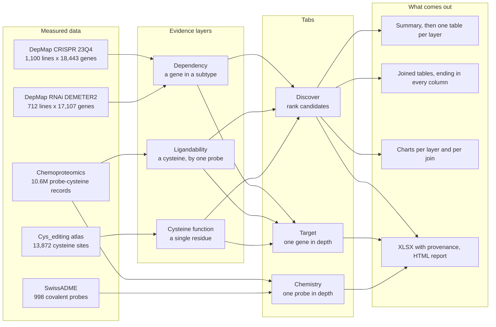

# CanProTarget

**A residue-resolved prioritization platform for covalent cancer drug discovery.**

[](https://www.gnu.org/licenses/agpl-3.0)
[](https://bertoldolab.shinyapps.io/CanProTarget/)
[](https://doi.org/10.5281/zenodo.22908609)

CanProTarget combines cancer functional genomics, cysteine ligandability and
residue-level functionality to prioritise covalent drug discovery targets.
Users can identify cancer-selective dependencies, determine which contain
chemically engaged cysteines, ask whether the exact engaged residue is
functional, and rank target–cysteine–ligand hypotheses using evidence tiers
and adjustable scoring.

| Layer | Question | Measured on |
|---|---|---|
| **Dependency** | Is this gene selectively required in this cancer subtype? | the gene, across cell lines |
| **Ligandability** | Does a covalent ligand engage one of its cysteines? | a cysteine, by a specific probe |
| **Cysteine function** | Does that exact cysteine have functional evidence? | a single residue |

Each layer is held at the resolution it was measured at. A functional cysteine
elsewhere in a protein is not evidence about the residue a ligand engages, and
gene-level integration conflates the two: across ten adult and ten paediatric
cancers, 62–73% of candidates produced by gene-level integration lacked
functional evidence at the engaged cysteine. Matching on the exact residue
removes those, at the cost of a smaller candidate set — cysteine-derived
evidence covers only 7.5–7.9% of the retained dependency associations. What
limits the approach is the reach of the experiments, not the arithmetic that
combines them, and the app is built to show which layers actually support a
given site rather than to imply agreement between them.

**Live app:** https://bertoldolab.shinyapps.io/CanProTarget/

---

## Contents

- [What you can do with it](#what-you-can-do-with-it)
- [Quick start](#quick-start)
- [Data](#data)
- [Repository layout](#repository-layout)
- [The CPT Score](#the-cpt-score)
- [Reproducing the manuscript benchmark](#reproducing-the-manuscript-benchmark)
- [Programmatic access (MCP)](#programmatic-access-mcp)
- [Deployment](#deployment)
- [Citation](#citation)
- [Licence and data sources](#licence-and-data-sources)

---

## What you can do with it

**Discover** — select a cancer subtype and narrow by any combination of the
three evidence layers. Switching a layer on adds its full section to the page:
summary tiles, every table that layer offers, and its interactive charts, below
the candidate table. Nothing is behind a tab, so what is on screen is exactly
what the chosen layers have to say.

**Target** — query a single gene: the subtypes where it is a dependency, the
distribution of gene effect across individual cell lines, the evidence tiers of
its engaged cysteines, the ligands that engage them, and a downloadable HTML
report that records the data versions it was built from.

**Chemistry** — SwissADME drug-likeness and physicochemistry for a selected
ligand, with its protein-binding profile.

Every table exports to `.xlsx` with a provenance sheet recording the settings
that produced it.

---

## How the data connects



Layers are joined on the exact cysteine, defined by UniProt accession and
residue number, rather than on the gene. A single active layer is reported on
its own terms; with two or three active, a row must satisfy each of them at
the same residue. Every view names the layers it was built from, so a joined
table is not read as the result of a single layer.

| Tab | Layers read | Question addressed |
|---|---|---|
| **Discover** | any combination of the three | which candidates in a subtype carry the selected combination of evidence |
| **Target** | all three, for one gene | how a gene behaves across subtypes, and which of its cysteines are engaged or functionally assayed |
| **Chemistry** | chemoproteomics and SwissADME | which cysteines a probe engages, and its physicochemical properties |

---

## Quick start

### 1. R

R ≥ 4.3 (developed against 4.5). The app runs from the system library; the
project does not use renv.

### 2. Packages

```r
install.packages(c(
  "shiny", "shinydashboard", "shinyjs", "shinyWidgets", "shinycssloaders",
  "DT", "plotly", "ggplot2", "dplyr", "tidyr", "readr", "tibble",
  "writexl", "yaml", "matrixStats", "limma", "htmlwidgets", "rmarkdown"
))
```

### 3. Data

Discover, Target and Chemistry read files that are already in the repository:

- `data/gene_index.rds` — dependency summaries and engaged sites
- `data/cys_editing_atlas.rds`
- `data/protein_binding_lookup_preprocessed.rds`
- `data/swissadme_preprocessed.rds`

The DepMap gene-effect matrices, the model metadata and the subtype lists
are not in git. The dependency dropdown, and a redeploy of the live app,
need them. How to build those files is in [data/README.md](data/README.md).
Where each dataset came from is in
[docs/DATA_PROVENANCE.md](docs/DATA_PROVENANCE.md). The versions the app
reports are in [`data/data_versions.yaml`](data/data_versions.yaml).

`data/raw/*.xlsx` is stored with Git LFS and is not read while the app is
running. Materialise the workbooks only if you are rebuilding the probe
table:

```bash
git lfs install
git lfs pull
```

### 4. Run

```bash
Rscript --vanilla -e 'shiny::runApp(".", port = 3838, host = "127.0.0.1", launch.browser = TRUE)'
```

### 5. Tests

```bash
Rscript --vanilla tests/test_cpt_agent_workflows.R
Rscript --vanilla tests/test_gene_key_matching.R
Rscript --vanilla tests/test_reports.R
mcp/.venv/bin/pytest tests/test_mcp_server.py -v   # MCP, needs mcp/.venv
```

---

## Data

| Source | Used for | Version |
|---|---|---|
| DepMap CRISPR (Chronos) | gene effect, confirmatory layer | 23Q4 |
| DepMap RNAi (DEMETER2) | gene effect, primary discovery layer | v6 |
| DepMap model metadata | cell line annotation, cohort definition | 23Q4 |
| Chemoproteomics (protein binding) | cysteine engagement, competition ratio | 1.0 |
| Cys_editing atlas | base-editing functional evidence per residue | 1.0 |
| SwissADME | probe physicochemistry and drug-likeness | 1.0 |

Licences for redistributed data are in [docs/DATA_LICENSES.md](docs/DATA_LICENSES.md).

Discover and Target read `data/gene_index.rds`. The chemoproteomics table is
loaded when a view asks for the underlying probe records.

---

## Repository layout

```
CanProTarget/
├── app.R                          Shiny entry point, shared data, tab routing
├── R/
│   ├── targets_panel.R            Discover: layered explorer, results sections
│   ├── dependencies_module.R      Discover: dependency analysis
│   ├── gene_module.R              Target tab
│   ├── swissadme_module.R         Chemistry tab
│   ├── cys_editing_module.R       Discover: cysteine atlas section
│   ├── canprotarget_score.R       CPT Score, evidence tiers, annotation
│   ├── api_functions.R            Pure query functions (no Shiny)
│   ├── mcp_worker.R               Warm R worker for the MCP server
│   ├── report_generator.R         HTML report rendering
│   ├── plot_palette.R             Shared chart palette and plotly defaults
│   ├── ui_kit.R                   Help, notes, section and empty-state components
│   └── app_config.R               UI configuration and CSS
├── data/                          Index, atlas, probe table, SwissADME; see data/README.md
├── docs/
│   ├── CPT_SCORE.md               Score definition and weights
│   ├── DATA_PROVENANCE.md         Where every dataset came from
│   ├── ARCHITECTURE.md            How the pieces fit together
│   ├── MAINTENANCE.md             Maintainer notes, data history, traps
│   ├── RELEASE_CHECKLIST.md       Release and Zenodo procedure
│   └── scripts/                   Preprocessing, index build, deployment,
│                                   screenshots
├── analysis/software_benchmark/   Manuscript benchmark code and outputs
├── mcp/                           MCP server
├── tests/                         Regression tests and known-target fixtures
└── inst/report_templates/         HTML report templates
```

---

## The CPT Score

A 0–100 composite over percentile-ranked evidence axes: dependency strength,
cancer selectivity, cysteine ligandability, conservation and clinical
(ClinVar) evidence, under default weights of 3, 3, 2, 1.5 and 1. ADME is
computed but carries a default weight of 0.

Weights are renormalised over the dimensions a candidate carries, so a gene
missing an axis is not penalised for it. Scores computed over different active
dimensions are therefore not directly comparable, and the number of active
dimensions is displayed alongside every score.

The score is a reproducible sensitivity layer rather than a calibrated
probability of tractability. The full definition is in
[docs/CPT_SCORE.md](docs/CPT_SCORE.md).

---

## Reproducing the manuscript benchmark

The tables in `analysis/software_benchmark/outputs/` are the 19 September
2026 run against this release. To run it again:

```bash
Rscript analysis/software_benchmark/work/run_software_benchmark.R \
  analysis/software_benchmark /path/to/benchmark-inputs
```

The second argument, or the environment variable `CPT_BENCHMARK_INPUTS`, is
a directory outside this repository containing:

- `rna_all_gene_statistics.rds` (MD5 `b5413367ad2e1aa34b79417ff9a20331`)
- `gene_level_vs_exact_summary.csv`
- `cohort_workflow_counts.csv`

CovPDB and UniProt tables used as the positive set are already in
`analysis/software_benchmark/data_external/`. The run stops if a required
file is missing. It scores with `R/canprotarget_score.R` and reads the
cysteine atlas, the binding table and the SwissADME descriptors from
`data/`.

---

## Programmatic access (MCP)

An MCP server exposes the same query logic to AI agents, backed by a warm R
worker so queries do not pay R startup cost. Tool reference and worked examples
are in [AGENTS.md](AGENTS.md).

---

## Deployment

```bash
Rscript docs/scripts/deploy_shinyapps.R
```

Whatever is checked out is what deploys, so a rollback is a checkout followed
by a redeploy. The script names the bundle contents explicitly, so the source
CSVs and the rebuild inputs under `data/raw/` are excluded.

---

## Citation

**Software** — Ong JP, Martins D, Bertoldo JB. *CanProTarget* (Version v1.0.0).
Zenodo. https://doi.org/10.5281/zenodo.22908610

For the latest version, use the concept DOI: https://doi.org/10.5281/zenodo.22908609

**Article** — Ong JP, Bell J, Martins D, Zhu J, Rodrigues T, Bertoldo JB.
*CanProTarget: a residue-resolved prioritization platform for covalent cancer
drug discovery*. In preparation.

Machine-readable metadata: [CITATION.cff](CITATION.cff).

---

## Licence and data sources

CanProTarget is released under the **GNU Affero General Public License v3.0**
([LICENSE](LICENSE)). Under the network clause, a modified version run as a
network service must offer its source to the users of that service.

Redistributed data carry their own terms — see [docs/DATA_LICENSES.md](docs/DATA_LICENSES.md).
DepMap data are used under their public release terms; the Cys_editing atlas,
chemoproteomics and SwissADME-derived properties are credited in
[docs/DATA_PROVENANCE.md](docs/DATA_PROVENANCE.md).

---

## Contact

Jean Bertoldo — <j.bertoldo@unsw.edu.au>
Children's Cancer Institute, Sydney, and School of Clinical Medicine, UNSW Sydney.
