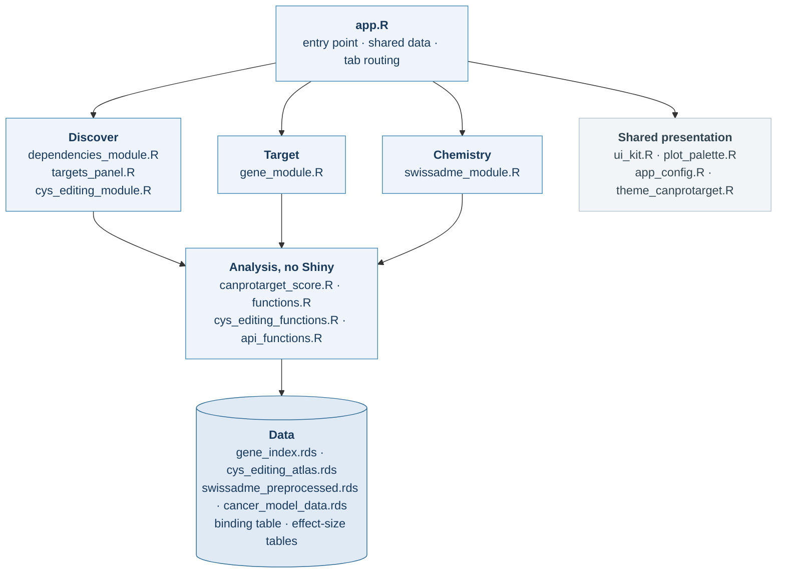
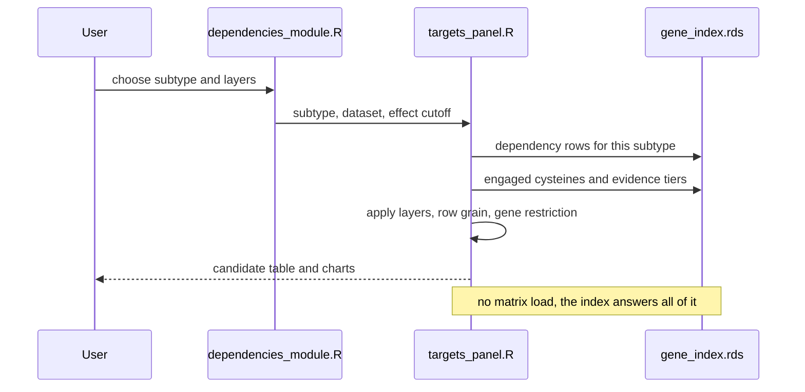

# Architecture

CanProTarget is a Shiny application with one entry point, four user-facing
tabs and a precomputed index that keeps them responsive. This document maps
the files onto that structure.

---

## 1. Application Overview

Four layers, read top to bottom. `app.R` loads the shared data and routes to
the tabs; the tabs call analysis code that holds no Shiny; both read from the
data layer.

What each tab reads, and when:

| Tab | Reads | When |
|---|---|---|
| Discover | `gene_index.rds` | startup |
| Discover | `precomputed_effectsizes/*.tsv` | on subtype change |
| Discover | binding table | ligandability layer on, or CR floor below 4 |
| Target | `gene_index.rds`, `cancer_model_data.rds`, atlas | startup |
| Chemistry | `swissadme_preprocessed.rds` | startup |
| Chemistry | binding table | protein-binding view |

Every tab draws through `ui_kit.R` and `plot_palette.R`, so help text, empty
states, colours and marker sizes are defined once. `app_config.R` carries the
CSS and hands off to `theme_canprotarget.R`.

---

## 2. Index

Two source tables are too large to query interactively:

| Source | Size | Cost |
|---|---|---|
| CRISPR gene effect matrix | 144 MB | seconds per query |
| Chemoproteomics binding table | 10.6M rows, 555 MB in memory | ~10 s to load |

`docs/scripts/build_gene_index.R` reduces both to `data/gene_index.rds`
(22 MB), which holds the gene roster, per-subtype dependency results, engaged
cysteines with their evidence tiers, probe summaries and per-cell-line effect
distributions. Discover and Target read only the index, so no interaction
costs a matrix load.

The binding table is still loaded when a view genuinely needs it: the
Ligandability analysis tab, or a competition-ratio floor below 4, which the
index does not store.

---

## 3. Offline Scripts

Run these to build the data the application reads. None runs at startup.

| Script | Produces |
|---|---|
| `preprocess_data.R` | DepMap matrices and model metadata as RDS |
| `rebuild_depmap_23q4.R` | Clean CRISPR 23Q4 matrix from the official release |
| `preprocess_protein_binding.R` | Chemoproteomics table from `table-s2.xlsx` |
| `build_protein_binding_factored.R` | Factored copy: 555 MB rather than 936 MB |
| `import_cys_editing_atlas.R` | Base-editing atlas |
| `reference_swissadme_from_csv.R` | SwissADME descriptors |
| `precompute_effectsizes_all_subtypes.R` | Per-subtype effect-size tables |
| `build_gene_index.R` | `gene_index.rds` — run this last |
| `deploy_shinyapps.R` | Publishes whatever is checked out |

---

## 4. Tab Modules

| File | Tab | Responsibility |
|---|---|---|
| `dependencies_module.R` | Discover | Layer controls, dependency analysis, probe tables |
| `targets_panel.R` | Discover | Layered explorer, candidate table, per-layer sections |
| `gene_module.R` | Target | Single-gene view and HTML report |
| `swissadme_module.R` | Chemistry | Drug-likeness, BOILED-Egg, radar, protein binding |
| `cys_editing_module.R` | Discover | Cysteine atlas section (residue evidence layer) |

Discover is built from two files: `dependencies_module.R` owns the tab and the
dependency analysis, and calls into `targets_panel.R` for the layered explorer
and the shared results region.

---

## 5. Analysis Layer

`canprotarget_score.R`, `functions.R`, `cys_editing_functions.R` and
`api_functions.R` hold no Shiny code and can be sourced on their own. That is
what makes the benchmark possible: `analysis/software_benchmark/` loads
`canprotarget_score.R` alone and recomputes every published score.

`mcp_worker.R` uses the same functions to serve the MCP tools described in
[AGENTS.md](../AGENTS.md).

---

## 6. Request Path

Selecting a subtype in Discover:

